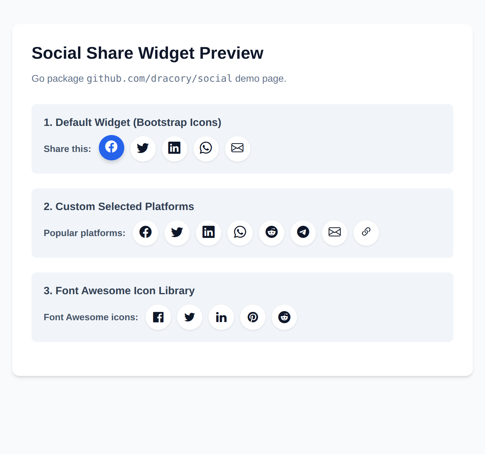

# social


[](https://github.com/dracory/social/actions/workflows/tests.yml)

## Preview


[](https://goreportcard.com/report/github.com/dracory/social)
[](https://pkg.go.dev/github.com/dracory/social)

## License

This project is licensed under the GNU Affero General Public License v3.0 (AGPL-3.0). You can find a copy of the license at [https://www.gnu.org/licenses/agpl-3.0.en.html](https://www.gnu.org/licenses/agpl-3.0.txt)

For commercial use, please use my [contact page](https://lesichkov.co.uk/contact) to obtain a commercial license.

## Introduction

Comprehensive social media share link generator for web content. Provides URL construction and proper encoding for all major social media platforms.

## Features

- **30+ Social Media Platforms**: Support for Facebook, Twitter/X, LinkedIn, Pinterest, Reddit, WhatsApp, and many more
- **URL Encoding**: Automatic proper URL encoding for all parameters
- **Customizable**: Full control over title, description, image, hashtags, and more
- **Lazy Evaluation**: Share links are generated on-demand
- **Platform-Specific**: Each platform gets the correct URL format and parameters
- **Ordered Lists**: Pre-defined popularity and alphabetical ordering for platforms

## Supported Platforms

- Facebook, Twitter/X, LinkedIn, Pinterest, Reddit
- WhatsApp, Telegram, Skype, SMS
- Email, Gmail, Yahoo Mail
- Blogger, Tumblr, LiveJournal
- Pocket, Evernote, Instapaper, Flipboard
- Google Bookmarks, Hacker News
- VK, Weibo, QZone, OK.ru, Douban, Renren
- Diaspora, Line.me, Threema, Xing

## Usage

### Basic Usage

```go
import "github.com/dracory/social"

// Create share links for a URL
shareLinks := social.NewQuick("https://example.com/my-page", "My Page Title", "https://example.com/image.jpg")

// Get individual share URLs
facebookURL := shareLinks.GetFacebookShareUrl()
twitterURL := shareLinks.GetTwitterShareUrl()
linkedinURL := shareLinks.GetLinkedInShareUrl()
pinterestURL := shareLinks.GetPinterestShareUrl()
```

### Advanced Usage (Full Customization)

```go
import "github.com/dracory/social"

params := social.ShareLinksParams{
    URL:          "https://example.com/my-page",
    Title:        "My Page",
    Description:  "A detailed description of the page",
    ImageURL:     "https://example.com/image.jpg",
    Via:          "myhandle",           // Twitter handle
    HashTags:     "golang,web,dev",    // Comma-separated hashtags
    EmailAddress: "user@example.com",
    PhoneNumber:  "+1234567890",
    UserID:       "ABC123",             // Threema user ID
    CCEmail:      "cc@example.com",
    BCCEmail:     "bcc@example.com",
}

shareLinks := social.New(params)

// Get any platform's share link
whatsappURL := shareLinks.GetWhatsAppShareUrl()
telegramURL := shareLinks.GetTelegramShareUrl()
emailURL := shareLinks.GetEmailShareUrl()
```

### Widget Generation

```go
import "github.com/dracory/social"

shareLinks := social.NewQuick("https://example.com/my-page", "My Page", "")

// Generate widget with default platforms and popup enabled (recommended)
// Popup is ENABLED BY DEFAULT for better UX
html := shareLinks.Widget(social.WidgetOptions{})

// Output includes HTML + popup JavaScript:
// <div id="social-links"><ul>
// <li><a href="..." class="social-button" id="social-facebook"><span class="bi-facebook"></span></a></li>
// <li><a href="..." class="social-button" id="social-twitter"><span class="bi-twitter"></span></a></li>
// ...
// </ul></div>
// <script>... popup functionality ...</script>

// Generate widget with custom platforms and Bootstrap icons
html = shareLinks.Widget(social.WidgetOptions{
    Platforms:   []string{social.PlatformFacebook, social.PlatformLinkedIn},
    IconLibrary: social.IconLibraryBootstrap,
})

// Disable popup if you want plain links (not recommended)
disablePopup := false
html = shareLinks.Widget(social.WidgetOptions{
    Platforms:   []string{social.PlatformFacebook, social.PlatformTwitter},
    EnablePopup: &disablePopup,
})

// Add a "Share" label before the icons
html = shareLinks.Widget(social.WidgetOptions{
    Platforms: []string{social.PlatformFacebook, social.PlatformTwitter, social.PlatformLinkedIn},
    ShareText: "Share",
})
```

### Popup Benefits (Enabled by Default)

The widget includes popup functionality by default, which provides:

- **Keeps users on your site** - No navigation away from your page
- **Centered 780x550 popup window** - Professional appearance
- **Graceful fallback** - If popup blocked, link opens normally
- **Vanilla JavaScript** - No jQuery or external dependencies
- **Smart handling** - `mailto:` and `sms:` links open normally, not in popup

### Platform Lists

```go
// Get nice names for all platforms
names := social.SocialMediaNiceNames()
// Returns: map[string]string{"facebook": "FaceBook", "twitter": "Twitter", ...}

// Get platforms ordered by popularity
popular := social.SocialMediaSitesByPopularity()
// Returns: []string{"google.bookmarks", "facebook", "reddit", ...}

// Get platforms ordered alphabetically
alphabetical := social.SocialMediaSitesByAlphabet()
// Returns: []string{"blogger", "diaspora", "douban", ...}
```

## API Reference

### Constructors

- `New(params ShareLinksParams) *ShareLinks` - Create share links with full customization
- `NewQuick(url, title, imageURL string) *ShareLinks` - Create share links for a URL with basic parameters

### ShareLinks Methods

All platforms have a `Get[Platform]ShareUrl()` method:
- `GetFacebookShareUrl()`, `GetTwitterShareUrl()`, `GetLinkedInShareUrl()`, `GetPinterestShareUrl()`
- `GetRedditShareUrl()`, `GetWhatsAppShareUrl()`, `GetTelegramShareUrl()`, `GetSkypeShareUrl()`
- `GetEmailShareUrl()`, `GetGmailShareUrl()`, `GetYahooShareUrl()`, `GetSMSShareUrl()`
- `GetBloggerShareUrl()`, `GetTumblrShareUrl()`, `GetLiveJournalShareUrl()`
- `GetPocketShareUrl()`, `GetEvernoteShareUrl()`, `GetInstapaperShareUrl()`, `GetFlipboardShareUrl()`
- `GetGoogleBookmarksShareUrl()`, `GetHackerNewsShareUrl()`
- `GetVKShareUrl()`, `GetWeiboShareUrl()`, `GetQZoneShareUrl()`, `GetOkRuShareUrl()`, `GetDoubanShareUrl()`, `GetRenrenShareUrl()`
- `GetDiasporaShareUrl()`, `GetLineMeShareUrl()`, `GetThreemaShareUrl()`, `GetXingShareUrl()`

### Widget Generation

- `Widget(opts WidgetOptions) string` - Generate HTML widget for social share links (includes popup JavaScript by default)
- `WidgetOptions` struct with fields:
  - `Platforms []string` - Platform selection (defaults to Facebook, Twitter, LinkedIn, WhatsApp, Email)
  - `IconLibrary string` - Choose between Font Awesome and Bootstrap icons (defaults to Bootstrap)
  - `EnablePopup *bool` - Enable popup functionality (defaults to true for better UX)
  - `ShareText string` - Text to display before share icons (e.g., "Share")

### Constants

Platform names:
- `PlatformBlogger`, `PlatformDiaspora`, `PlatformDouban`, `PlatformEmail`, `PlatformEvernote`
- `PlatformFacebook`, `PlatformFlipboard`, `PlatformGmail`, `PlatformGoogleBookmarks`, `PlatformInstapaper`
- `PlatformLineMe`, `PlatformLinkedIn`, `PlatformLiveJournal`, `PlatformHackerNews`, `PlatformOkRu`
- `PlatformPinterest`, `PlatformPocket`, `PlatformQZone`, `PlatformReddit`, `PlatformRenren`
- `PlatformSkype`, `PlatformSMS`, `PlatformTelegramMe`, `PlatformThreema`, `PlatformTumblr`
- `PlatformTwitter`, `PlatformVK`, `PlatformWeibo`, `PlatformWhatsApp`, `PlatformXing`, `PlatformYahoo`

Submit URLs (for sharing):
- `SubmitURLBlogger`, `SubmitURLDiaspora`, `SubmitURLDouban`, `SubmitURLEmail`, `SubmitURLEvernote`
- `SubmitURLFacebook`, `SubmitURLFlipboard`, `SubmitURLGmail`, `SubmitURLGoogleBookmarks`, `SubmitURLInstapaper`
- `SubmitURLLineMe`, `SubmitURLLinkedIn`, `SubmitURLLiveJournal`, `SubmitURLHackerNews`, `SubmitURLOkRu`
- `SubmitURLPinterest`, `SubmitURLPocket`, `SubmitURLQZone`, `SubmitURLReddit`, `SubmitURLRenren`
- `SubmitURLSkype`, `SubmitURLSMS`, `SubmitURLTelegramMe`, `SubmitURLThreema`, `SubmitURLTumblr`
- `SubmitURLTwitter`, `SubmitURLVK`, `SubmitURLWeibo`, `SubmitURLWhatsApp`, `SubmitURLXing`, `SubmitURLYahoo`

Domain URLs (for linking):
- `DomainURLBlogger`, `DomainURLDiaspora`, `DomainURLDouban`, `DomainURLEvernote`, `DomainURLFacebook`
- `DomainURLFlipboard`, `DomainURLGmail`, `DomainURLInstapaper`, `DomainURLLineMe`, `DomainURLLinkedIn`
- `DomainURLLiveJournal`, `DomainURLHackerNews`, `DomainURLOkRu`, `DomainURLPinterest`, `DomainURLPocket`
- `DomainURLQZone`, `DomainURLReddit`, `DomainURLRenren`, `DomainURLSkype`, `DomainURLTelegram`
- `DomainURLThreema`, `DomainURLTumblr`, `DomainURLTwitter`, `DomainURLVK`, `DomainURLWeibo`
- `DomainURLWhatsApp`, `DomainURLXing`, `DomainURLYahoo`

Font Awesome icon classes:
- `FontAwesomeBlogger`, `FontAwesomeDiaspora`, `FontAwesomeDouban`, `FontAwesomeEmail`, `FontAwesomeEvernote`
- `FontAwesomeFacebook`, `FontAwesomeFlipboard`, `FontAwesomeGmail`, `FontAwesomeGoogleBookmarks`, `FontAwesomeInstapaper`
- `FontAwesomeLineMe`, `FontAwesomeLinkedIn`, `FontAwesomeLiveJournal`, `FontAwesomeHackerNews`, `FontAwesomeOkRu`
- `FontAwesomePinterest`, `FontAwesomePocket`, `FontAwesomeQZone`, `FontAwesomeReddit`, `FontAwesomeRenren`
- `FontAwesomeSkype`, `FontAwesomeSMS`, `FontAwesomeTelegramMe`, `FontAwesomeThreema`, `FontAwesomeTumblr`
- `FontAwesomeTwitter`, `FontAwesomeVK`, `FontAwesomeWeibo`, `FontAwesomeWhatsApp`, `FontAwesomeXing`, `FontAwesomeYahoo`

Bootstrap icon classes:
- `BootstrapIconBlogger`, `BootstrapIconDiaspora`, `BootstrapIconDouban`, `BootstrapIconEmail`, `BootstrapIconEvernote`
- `BootstrapIconFacebook`, `BootstrapIconFlipboard`, `BootstrapIconGmail`, `BootstrapIconGoogleBookmarks`, `BootstrapIconInstapaper`
- `BootstrapIconLineMe`, `BootstrapIconLinkedIn`, `BootstrapIconLiveJournal`, `BootstrapIconHackerNews`, `BootstrapIconOkRu`
- `BootstrapIconPinterest`, `BootstrapIconPocket`, `BootstrapIconQZone`, `BootstrapIconReddit`, `BootstrapIconRenren`
- `BootstrapIconSkype`, `BootstrapIconSMS`, `BootstrapIconTelegramMe`, `BootstrapIconThreema`, `BootstrapIconTumblr`
- `BootstrapIconTwitter`, `BootstrapIconVK`, `BootstrapIconWeibo`, `BootstrapIconWhatsApp`, `BootstrapIconXing`, `BootstrapIconYahoo`

Icon library types:
- `IconLibraryFontAwesome`, `IconLibraryBootstrap`

### Helper Functions

- `SocialMediaNiceNames() map[string]string` - Get display names for all platforms
- `SocialMediaSitesByPopularity() []string` - Get platforms ordered by popularity
- `SocialMediaSitesByAlphabet() []string` - Get platforms ordered alphabetically

## Dependencies

This package has no external dependencies. It uses only the Go standard library (`net/url`, `sort`, `strings`).

## Example

An example web server demonstration is provided in the [`examples/`](./examples) directory. To run it locally:

```bash
go run ./examples/main.go
```

Then navigate to `http://localhost:8080` in your web browser to view the interactive widget previews.

## Testing

Run tests with:
```bash
go test ./...
```

## Migration

This package was renamed from `pkg/sharelinks` to `pkg/social` with API improvements.

**Before (sharelinks):**
```go
import "github.com/dracory/sharelinks"
shareLinks := sharelinks.NewShareLinks(postID, postSlug, postTitle, postImageURL)
facebookURL := shareLinks.GetFacebook()
```

**After (social):**
```go
import "github.com/dracory/social"
shareLinks := social.NewQuick(url, title, imageURL)
facebookURL := shareLinks.GetFacebookShareUrl()
```

Or for full customization:
```go
import "github.com/dracory/social"
params := social.ShareLinksParams{...}
shareLinks := social.New(params)
```

## Similar Projects

- [social-icons-widget-by-wpzoom](https://github.com/wpzoom/social-icons-widget-by-wpzoom) - WordPress social icons widget
